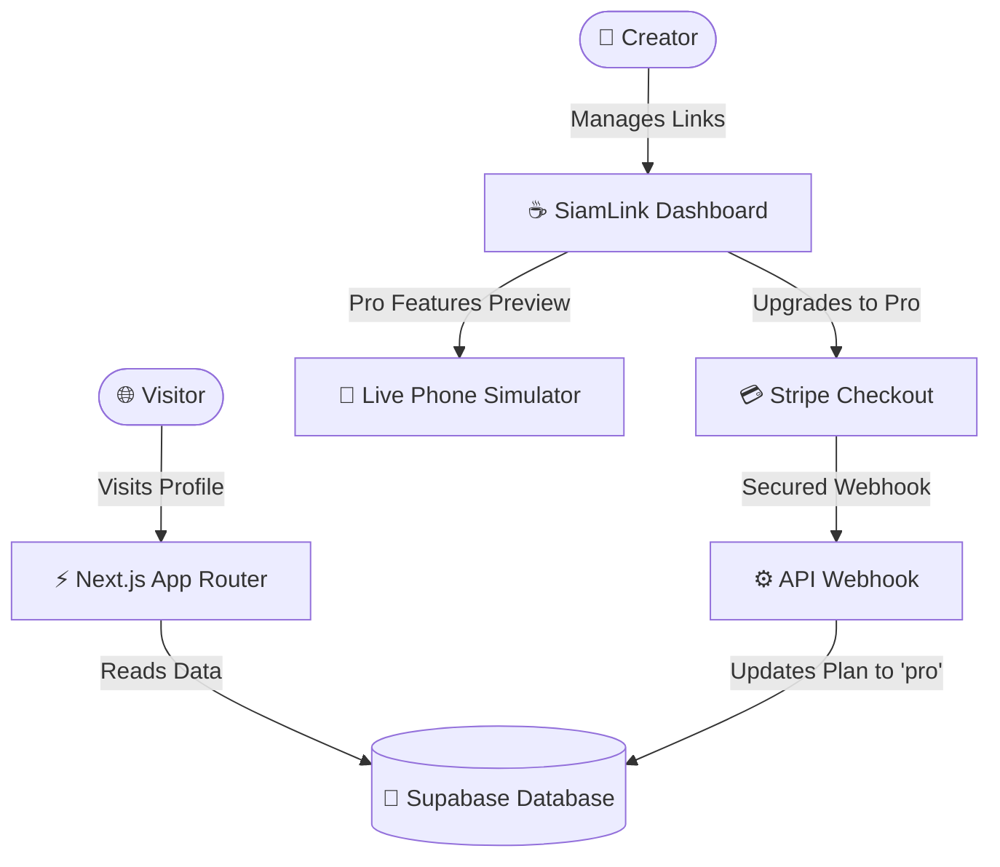

# ☕ SiamLink — Minimalist Link-in-Bio Platform
> **A high-end, premium minimalist Link-in-Bio platform custom-tailored for Thai creators, entrepreneurs, and e-commerce.**

[](https://nextjs.org/)
[](https://supabase.com/)
[](https://stripe.com/)
[](https://tailwindcss.com/)
[](https://opensource.org/licenses/MIT)

---

## 🎨 Premium Aesthetics meets Thai E-Commerce
**SiamLink** is not just another link-in-bio tool. It is a carefully curated digital storefront designed for the modern Thai creator economy. By blending a warm, cozy cafe-inspired visual system with native local utility optimizations (PromptPay QR codes, one-tap bank copy buttons, and deep LINE app redirection), SiamLink transforms a standard link list into an engaging social gateway.



---

## ✨ Key Features (ฟีเจอร์เด่น)

### 1. Warm Minimalist Themes (ธีมคาเฟ่อบอุ่นผ่อนคลาย)
- **12 Curated Visual Palettes:** Access standard designs like *Cafe Minimal* and *Clean Light*, or unlock high-end premium selections such as *Pastel Dream*, *Sleek Luxury*, *Midnight Neon*, and *Forest Haze*.
- **Interactive Live Simulator:** Creators can customize their visual profile and see changes render in real-time in a pixel-perfect smartphone container mock.

### 2. Tailor-Made for Thai Commerce (เพื่อการค้าขายสไตล์ไทย)
- **Direct Bank Copy Button:** Display bank details with native logo icons, account numbers, and a lightning-fast one-tap clipboard copy function.
- **Smart LINE Deep-Linking:** Links pointing to LINE app channels automatically open the native LINE application on iOS & Android devices instead of opening an in-app browser fallback.

### 3. Integrated Live Media Player (วิดีโอในหน้าเดียว)
- **Responsive Embed Players:** Render responsive inline YouTube and TikTok video players (`<iframe>`) directly on the profile page, encouraging higher click-throughs and retention rates.

### 4. Stripe-Powered PromptPay & Card Checkouts
- **Local Payment Support:** Secure upgrades to the **SiamLink Pro Plan (129 THB/month)** through an official, hosted Stripe Checkout portal supporting both **PromptPay QR** and credit/debit cards.
- **Sandbox Preview Experience:** Free-tier users can fully test, toggle, and preview all Pro features (removing watermark, wiggle animations, video players, and pastel themes) live inside the interactive simulator before subscribing.

---

## 💎 Pricing Plans (แผนราคาสำหรับทุกคน)

| Feature | Free Plan (0 THB) | Pro Plan (129 THB/mo) |
| :--- | :---: | :---: |
| **Price** | Free Forever | 129 THB / Month |
| **Watermark** | "สร้างลิงก์ฟรีด้วย SiamLink" | **No Watermark (ลบลายน้ำ)** |
| **Themes** | 2 Themes (Cafe, Clean) | **All 12 Premium Themes** |
| **Video Embeds** | Limit to 1 Video Link | **Unlimited Videos (ไม่จำกัด)** |
| **Highlight Animations** | Not available | **Wiggle Highlight (ปุ่มดึงดูดสายตา)** |
| **Advanced Analytics** | Basic clicks | **Comprehensive Analytics** |

---

## 📂 Project Directory Structure

```
SiamLink/
├── .github/
│   └── ISSUE_TEMPLATE/     # Interactive bug & feature templates in Thai
├── public/                 # Icons, badges, and default assets
├── src/
│   ├── app/                # Next.js App Router (15.x)
│   │   ├── [username]/     # Dynamic public profile paths
│   │   ├── api/            # Stripe Checkouts & Supabase webhook sync triggers
│   │   ├── dashboard/      # Premium editor dashboard & analytics panels
│   │   └── page.tsx        # High-end minimalist Landing Page
│   ├── components/         # Reusable dashboard widgets & public cards
│   └── lib/                # Database configurations, types, and helper hooks
├── supabase/
│   └── schema.sql          # Base relational schema tables & triggers
├── CONTRIBUTING.md         # Full Thai local setup and repository guidelines
├── LICENSE                 # Open-source MIT License registry
└── package.json            # Dependencies and scripts definitions
```

---

## 🛠️ Local Installation & Setup

Get SiamLink up and running on your local development workstation in five minutes.

### Prerequisites
- Ensure [Node.js](https://nodejs.org/) (v18.x or later) is installed.
- Setup a [Supabase](https://supabase.com/) project.
- Create a [Stripe](https://stripe.com/) Developer account.

### 1. Clone & Install Dependencies
```bash
git clone https://github.com/ThongBunjua/SiamLink.git
cd SiamLink
npm install
```

### 2. Configure Environment Variables
Create a `.env.local` file in the root of the project directory and fill in your keys based on `.env.example`:
```env
NEXT_PUBLIC_SUPABASE_URL=https://your-project-ref.supabase.co
NEXT_PUBLIC_SUPABASE_ANON_KEY=eyJhbGciOi...
SUPABASE_SERVICE_ROLE_KEY=eyJhbGciOi...

STRIPE_SECRET_KEY=sk_test_...
STRIPE_WEBHOOK_SECRET=whsec_...
NEXT_PUBLIC_APP_URL=http://localhost:3000
```

### 3. Setup the Database Schema
Execute the queries in `supabase/schema.sql` inside your Supabase SQL Editor. This will register:
- A secure `profiles` relational table linking to Auth IDs.
- A `links` table for user bio anchors.
- A `clicks` table tracking live page visitor metrics.

### 4. Spin up the Development Server
```bash
npm run dev
```
Open [http://localhost:3000](http://localhost:3000) in your web browser to explore your local copy of SiamLink!

---

## 🔒 Security & Safe Pushes
We strictly isolate variables. Credentials and keys are protected in the local sandbox environment. The repository is pre-configured with rules in the active `.gitignore` which automatically block commits containing:
- Any custom `.env` or `.env.local` environments.
- Temporary bundler caches (`.next/`).
- Local dependencies (`node_modules/`).

---

## 🤝 Contributing (การร่วมพัฒนา)
We welcome contributions from Thai developers and creators worldwide! Please review our fully localized [CONTRIBUTING.md](file:///c:/Users/Bokuw/Desktop/SiamLink/CONTRIBUTING.md) guide for details on folder structures, pull request rules, and visual quality compliance guidelines.

---

## 📄 License
This repository is open-sourced under the terms of the **MIT License**. Check out the [LICENSE](file:///c:/Users/Bokuw/Desktop/SiamLink/LICENSE) file for the legal framework and usage rights.

---
*Developed with care by **Thong Bunjua** ☕✨. Supporting Thai creators with aesthetic freedom.*
